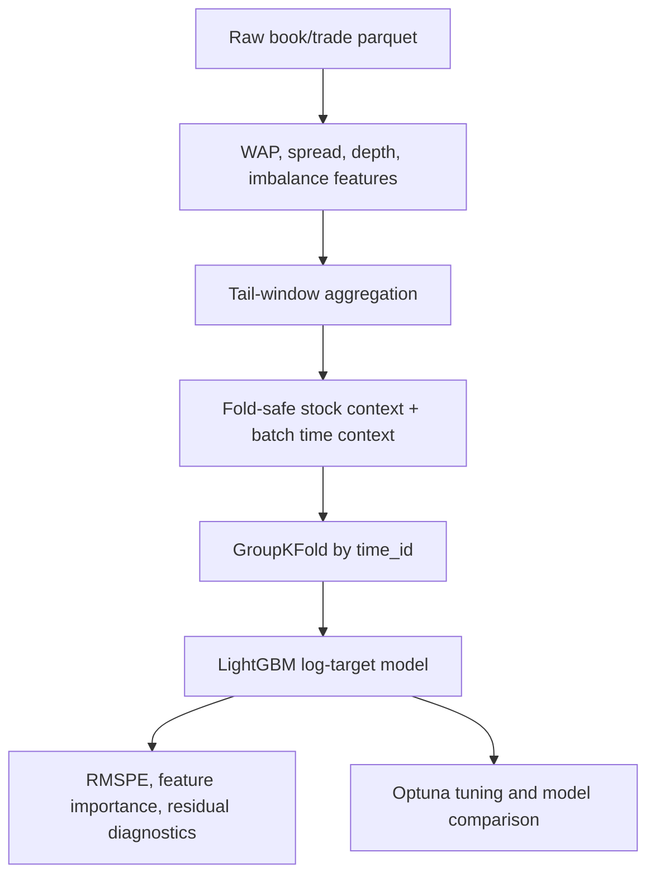

# Optiver Realized Volatility Forecasting

This is my end-to-end realized volatility forecasting project based on the Optiver Kaggle dataset. I use it to show how I approach a quantitative ML problem: start from market microstructure intuition, build features carefully, validate without leaking market events across folds, and compare the main model against sensible alternatives.

## Final Results

The repository does not include raw Kaggle data, so exact metrics are generated after running the notebook. The notebook writes the final report to `reports/model_summary.md`.

- Baseline RMSPE: pending notebook run
- LightGBM OOF RMSPE: pending notebook run
- Relative RMSPE reduction: pending notebook run
- Number of engineered features: pending notebook run
- CV strategy: `GroupKFold` by `time_id`
- Main feature groups: WAP returns, realized-volatility moments, spread/depth signals, order imbalance, tail-window features, trade-flow features, and cross-sectional context features

## Workflow



## Project Scope

- Feature engineering from limit-order-book and trade data.
- Leakage-aware grouped validation by market time bucket.
- LightGBM main model trained on log-volatility and evaluated with RMSPE.
- Optional Optuna tuning plus model comparison against CatBoost and a tabular MLP baseline.
- Post-model diagnostics, feature importance analysis, and difficult-stock/time-bucket review.

## Repository Structure

```text
.
├── optiver_realized_volatility_portfolio.ipynb
├── src/
│   ├── features.py
│   ├── validation.py
│   ├── model.py
│   ├── metrics.py
│   └── utils.py
├── reports/
│   ├── model_summary.md
│   └── fold_scores.csv
├── requirements.txt
└── README.md
```

The notebook is the main report. The `src/` folder separates the reusable feature, validation, metric, and model utilities so the project is easier to inspect than a single long notebook.

## Report Outputs

After running the notebook, the following files are updated or generated:

```text
reports/
  model_summary.md
  fold_scores.csv
  feature_importance.png
  residual_diagnostics.png
```

## Run

On Kaggle, the default paths should work. For local execution:

```bash
export OPTIVER_DATA_DIR=/path/to/optiver-realized-volatility-prediction
export OPTIVER_WORK_DIR=./working
jupyter notebook optiver_realized_volatility_portfolio.ipynb
```

For a quick smoke test:

```bash
export DEBUG_STOCK_LIMIT=5
```

Optional experiments:

```bash
export RUN_TUNING=1
export OPTUNA_TRIALS=15
export RUN_MODEL_COMPARISON=1
```

## Limitation

This is a Kaggle-style supervised forecasting project. The validation design is leakage-aware by `time_id`, but the model is not a production trading strategy and does not simulate transaction costs, latency, slippage, or live execution.


## Dependencies

See `requirements.txt`.
